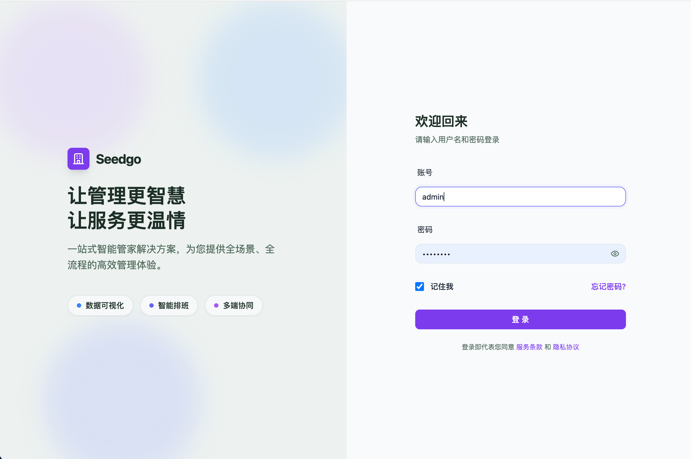
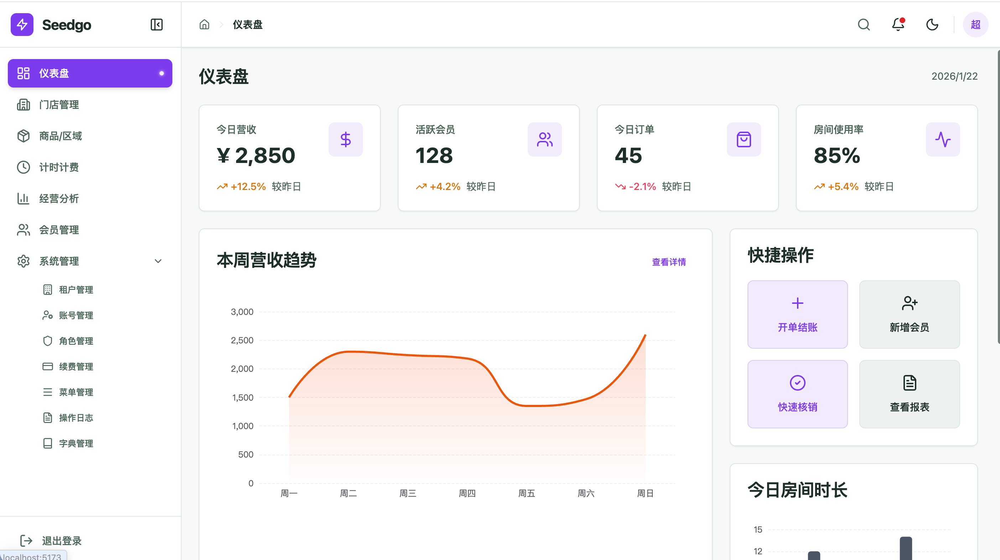
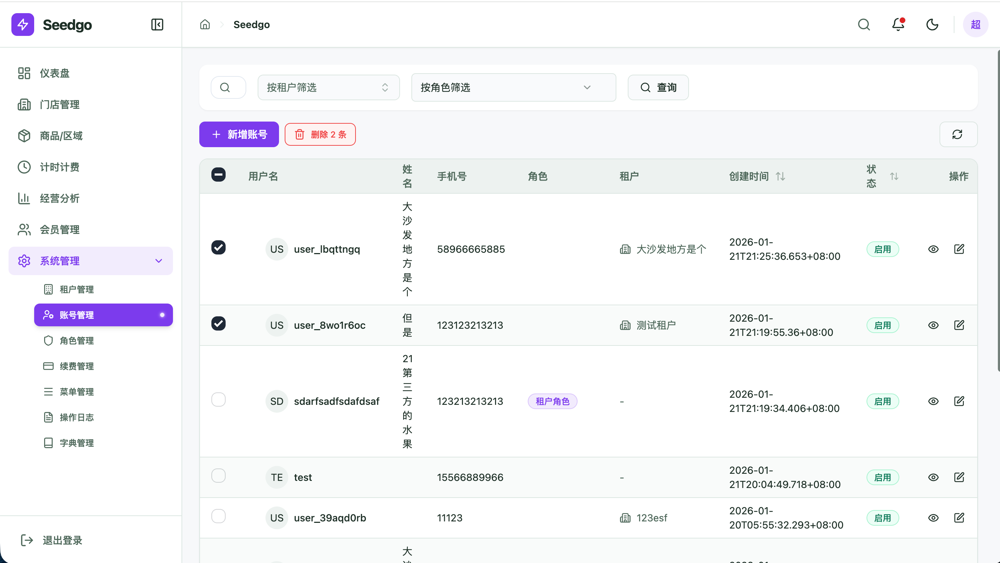
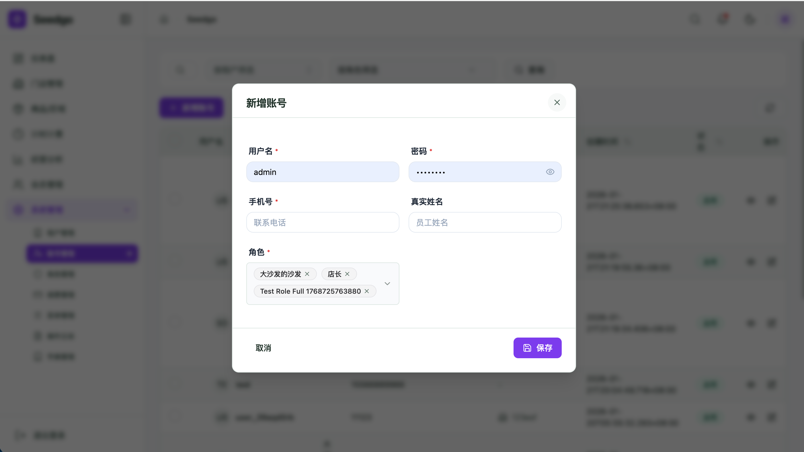
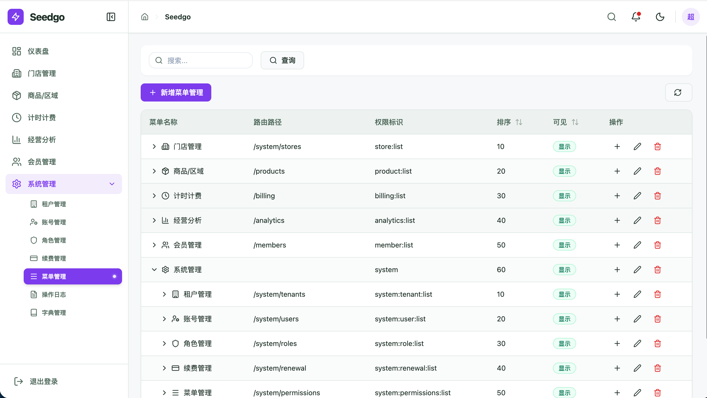

# SeedGo 后端脚手架

SeedGo 是一个基于 Go 语言的企业级现代后端开发脚手架，采用分层架构设计，集成了用户管理、角色权限控制（RBAC）、多租户支持等核心功能。它旨在帮助开发者快速搭建高性能、可扩展的
Web 应用程序。

## 🛠 技术栈

- **编程语言**: Go (1.25+)
- **Web 框架**: [Gin](https://github.com/gin-gonic/gin)
- **ORM 框架**: [GORM](https://gorm.io/) (MySQL)
- **配置管理**: [Viper](https://github.com/spf13/viper)
- **认证授权**: JWT (JSON Web Token)
- **容器化**: Docker & Docker Compose

## ✨ 核心特性

- **模块化设计**: 采用 `internal` 目录隔离私有代码，结构清晰。
- **RBAC 权限模型**: 内置完善的用户、角色、权限管理逻辑。
- **多租户架构**: 支持多租户数据隔离与管理。
- **标准化响应**: 统一的 API 响应格式与错误处理。
- **环境隔离**: 支持本地开发、测试、生产等多环境配置。

## 📸 系统截图

<p align="center">
  
  
</p>
<p align="center">
  
  
  
</p>

## 启动步骤

### 后端

- 在`config/local.yaml`中配置数据库连接信息。

```yaml
database:
  dsn: "root:123456@tcp(127.0.0.1:3306)/smart?charset=utf8mb4&parseTime=True&loc=Local"
```

+ 生成表结构和创建admin用户
```shell
go run cmd/migrate/main.go
```

- 菜单权限
> 将 `cmd/migrate/permission.sql` 导入到数据库就可以了

+ 运行启动命令

```shell
go run main.go
```

### 前端

```shell
cd frontend
npm install
npm run dev
```

### 访问地址

http://localhost:5173

用户名：admin

密码：123456

## 实现的功能模块

+ 登录
+ 权限检查和拦截
+ 租户
+ 用户
+ 角色
+ 菜单权限
+ 操作日志
+ 字典

> 除了上诉的模块，其他的功能模块和页面，只是个例子，需要自行结合业务代码来删减或新增。这只是一个脚手架，只帮你做了基础的功能模块，其余的自行开发。

## 缓存

为了减少配置，默认redis没有启用，使用的是内存缓存，如果项目部署超过1台，需要改为redis作为缓存。缓存目前是只用到了用户的角色权限中。涉及到role、permsions两个表的编辑、删除，都会清除所有缓存。

> main.go 初始化的时候可以更改使用redis，自行配置redis的url

```go
global.Cache = cache.Use(cache.NewRedisCache(redisClient))
```

## 租户

如果表结构有`tenant_id`和结构体`TenantID`，就会默认在操作这边表的CRUD语句自动添加当前用户的租户id，对业务无侵入，开发无感。

## 删除和软删除

如果表结构有`DeletedAt`字段，那么默认就是软删除，如果没有就是硬删除。


## 📝 常用命令

| 命令                     | 说明                 |
|------------------------|--------------------|
| `make build`           | 编译项目生成二进制文件 `main` |
| `go run main.go`       | 本地开发模式运行           |
| `docker-compose up -d` | 启动数据库服务            |
| `docker-compose down`  | 停止并移除数据库服务         |

## 🤝 贡献指南

欢迎提交 Issue 和 Pull Request 来改进本项目。

## 📄 许可证

[BUSINESS SOURCE LICENSE](LICENSE)

个人和非盈利组织以研究学习试用免费，用于商业用途目的和其余商业组织需购买授权。
